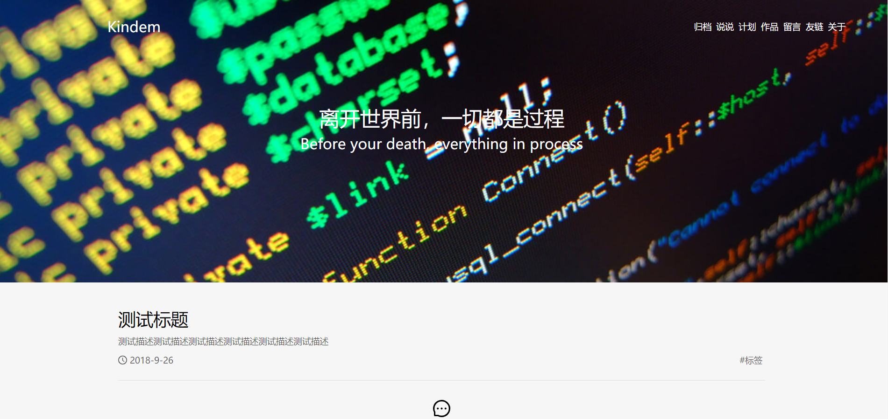

# Kindem的博客 第三版 前端 (施工中)
个人博客从诞生以来也有快两年历史里，刚好如今步入大四，准备把博客使用全新技术栈翻新一下，这样一来也算对得起在大学的主战场了。

现在博客正在施工中，预计还需要不少时日，我且快马加鞭，尽量早日保质保量完成。

废话不多说，先上一发预览图:

你也可以点击这个链接来参与`preview`:

[Kindem的博客Version 3.0 (Preview)](http://www.kindemh.cn/preview/#/)

# 技术栈
* 构建: `Node.js`、`Babel`、`Webpack`
* 前端界面库: `React`
* UI库: `Ant-Design`
* Ajax: `axios`

另外，这个仓库是独立的前端仓库，如果需要参考与该项目配合使用的后端仓库，地址在这里:

[GitHub FlyAntNotDown blog-v3-backend](https://github.com/FlyAndNotDown/blog-v3-backend)

# Why not Hexo or Jekyll ?
很多人可能更加喜欢使用`hexo`和`jekyll`配合`github`提供的`io`页面来构建自己的静态博客。但是我并没有选择他们，并不是说他们两者不好用或者不完善，他们都是非常优秀的框架。

我选择自己构建博客的原因是我认为作为博客，应该有自己的特色与风格，并且自己也想尝试一下使用全新的技术栈来构建一个崭新的`Web`应用，所以我一直没有选择`hexo`和`jekyll`

# 接口与配置文档
这一部分我将在将来完善，以便需要参考该项目构建自己博客的朋友们有更好的体验。

# 私有化指南
同上

# End
最后，欢迎大家`star`、`fork`
